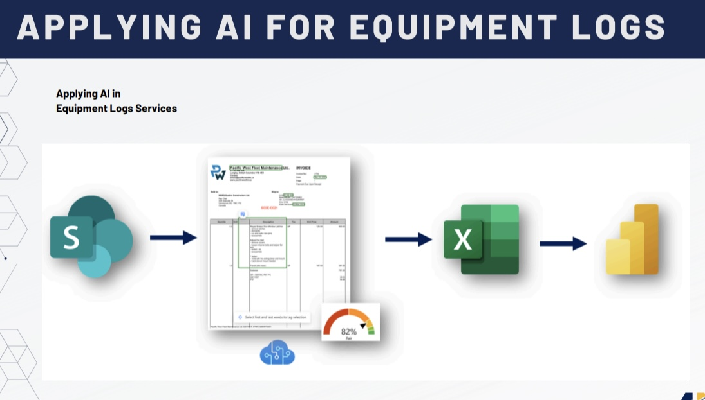

# 📦 Microsoft Flow PO Requests (AI)

---

## 🧭 Overview
**Microsoft Flow PO Requests (AI)** is a Power Automate solution created to streamline the intake and processing of Purchase Requisition Forms. When a document is uploaded to a SharePoint project folder, the flow is triggered, an AI model extracts the form's data, and the content is structured into a SharePoint-hosted Excel spreadsheet. This flow enhances efficiency and eliminates manual entry errors for over 40 active project folders.

### Flow

---

## 💡 Idea & Concept
The flow was originally designed to automate repetitive PO request data entry. Instead of having users manually copy form data, the system:
- Detects when a document is uploaded to a SharePoint folder.
- Uses AI Builder to extract structured data from purchase requisition forms.
- Writes the extracted rows into a dedicated SharePoint spreadsheet.
- Notifies the system administrator at the beginning and completion of each run.
- Logs timestamps for auditing and traceability.

---

## ✨ Features
- ✅ Triggered by new file uploads in SharePoint.
- 🤖 Extracts item tables using an AI Builder structured document model.
- 📄 Inserts extracted rows into a SharePoint-hosted Excel spreadsheet.
- 📧 Sends Outlook email notifications at start and end.
- 🕒 Saves processing timestamp for tracking.
- 🗂️ Deployed individually across 40+ project folders with unique triggers.

## ⚙️ Tech Stack
| **Category**          | **Tools & Technologies**                                                                                  |
|-----------------------|-----------------------------------------------------------------------------------------------------------|
| **Power Automate**     |        |
| **AI Builder**         |                        |
| **SharePoint**         |                          |
| **Excel**              |                                         |
| **Outlook**            |                                  |
| **JSON**               |                                                      |
| **Project Management**   |  |

---

## 🧑‍💻 My Role
- 💼 Built the full end-to-end logic in Power Automate.
- 🔧 Trained and maintained the AI Builder model for accurate form extraction.
- 📂 Configured 40+ project folder triggers for tailored flow behavior.
- 🛡️ Ensured data handling security and workflow consistency.
- ⚙️ Added logging and notification workflows for process visibility.

---

## 🧗 Challenges & Learnings
- Fine-tuned the AI Builder model to interpret variations in form layout.
- Built consistent error handling across dynamic SharePoint environments.
- Ensured consistent Excel formatting and cell integrity for each run.
- Optimized Power Automate’s “Apply to Each” loop performance.

---

## 📈 Future Enhancements
- Centralize flows with dynamic folder/path references to reduce duplication.
- Introduce approval flows with role-based controls before final export.
- Create integrated dashboards using Power BI to visualize purchase requests.

---

## 🪪 License
Internal tool developed for Quattro Constructors. Not for public distribution.

---

## 🔗 Related Projects
- [Quattrofy Web App](#)
- [Quattrofy API](#)
- [QuattroMan Copilot Agent](#)
